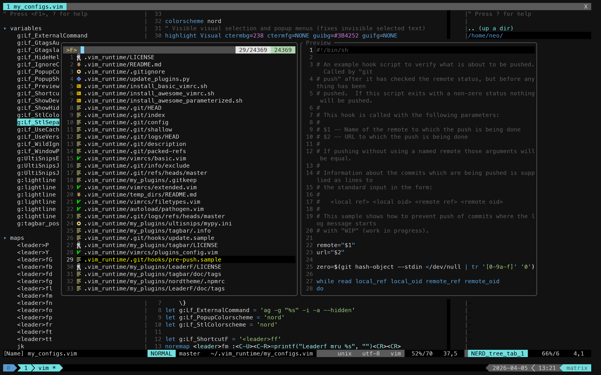

# Dotfiles

One-command Debian/Ubuntu dev bootstrap: Oh My Zsh + Powerlevel10k, Oh My Tmux, fzf, Meslo NF, Vim from source (+Python3).



## Run

```bash
curl -fsSL https://raw.githubusercontent.com/neomatrixlab/dotfiles/main/install.sh | bash
```

## Feature overview

- **System packages** — Installs common CLI tools via APT (Git, Tmux, Zsh, `autojump`, `ag`, build toolchain, Python 3 headers, `bat`, `btop`, `xclip`, and related build deps for Vim).
- **Vim** — Builds Vim from source with huge features and Python 3, installs to `/usr/local`, and replaces distro Vim packages. Configures [amix/vimrc](https://github.com/amix/vimrc) with custom `my_configs.vim` (Nord, LeaderF, Tagbar, UltiSnips, EasyMotion, clipboard maps, and more).
- **Shell** — [Oh My Zsh](https://ohmyz.sh/) with [Powerlevel10k](https://github.com/romkatv/powerlevel10k) (lean config), `zsh-autosuggestions`, `zsh-syntax-highlighting`, and optional auto-start of Tmux in interactive shells.
- **Tmux** — [Oh My Tmux](https://github.com/gpakosz/.tmux) with local tweaks (Nord TPM plugin, vi-style keys, custom prefix).
- **Fuzzy finder** — [fzf](https://github.com/junegunn/fzf) with Zsh integration: `ag` as the default file command and `bat`-based preview where available.
- **Fonts** — MesloLGS NF from [powerlevel10k-media](https://github.com/romkatv/powerlevel10k-media), installed under your user font directory and refreshed with `fc-cache`.
- **Git & BAT** — Sets `core.editor` to the self-built Vim when present (otherwise `vim`). On Debian/Ubuntu, symlinks `batcat` to `bat` if `bat` is missing.
- **Login shell** — Attempts `chsh` to Zsh when it is not already your login shell.
- **Implementation notes** — Run as a normal user (not root) with `sudo` available. Git clones used by this script are shallow (`--depth=1`) where applicable. The installer drops you into a new login Zsh at the end.
